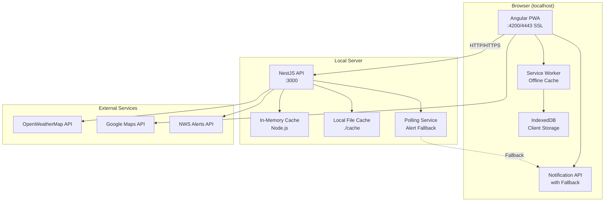
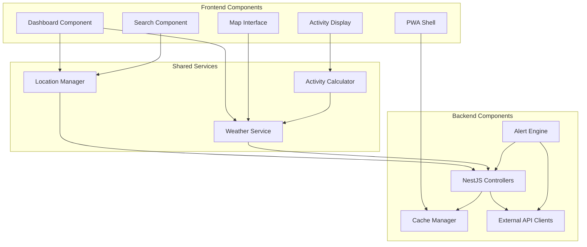
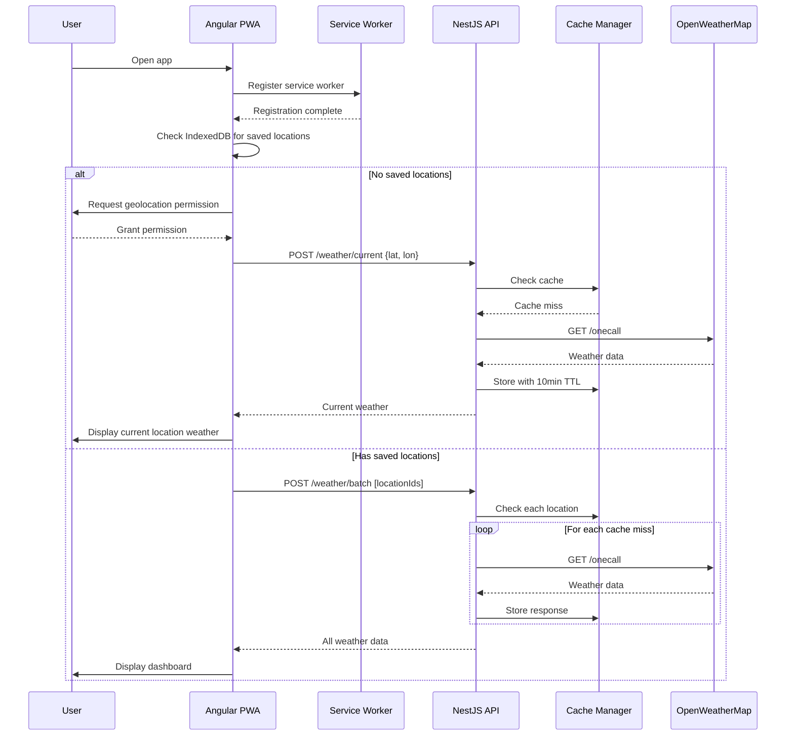
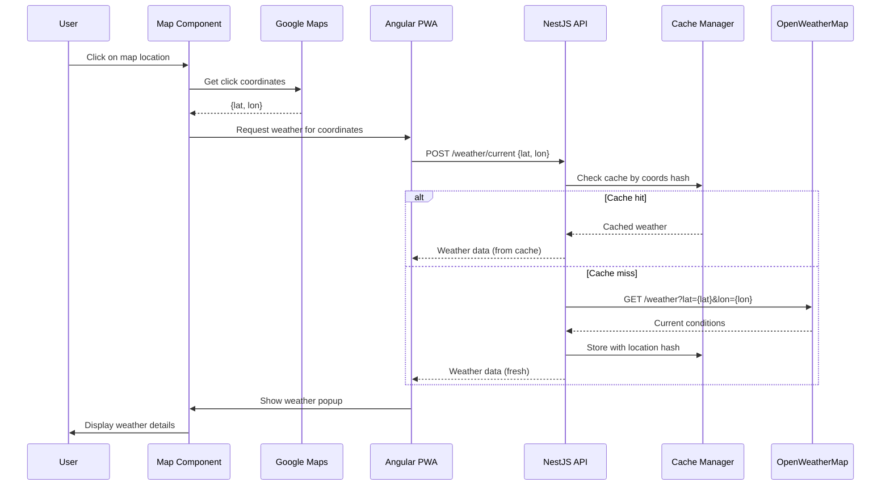
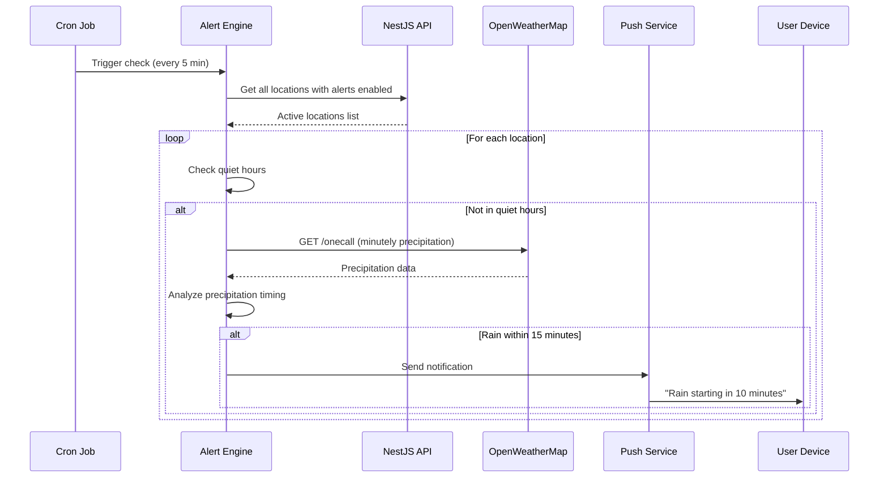

# DatDude Weather Fullstack Architecture Document

## Introduction

This document outlines the complete fullstack architecture for DatDude Weather, including backend systems, frontend implementation, and their integration. It serves as the single source of truth for AI-driven development, ensuring consistency across the entire technology stack.

This unified approach combines what would traditionally be separate backend and frontend architecture documents, streamlining the development process for modern fullstack applications where these concerns are increasingly intertwined.

### Starter Template or Existing Project

Based on review of the PRD and brief, this is a **greenfield project** using **npm workspaces** for monorepo management (simplified from the originally specified Nx workspace for faster MVP development). The workspace will manage both the Angular 20 frontend and NestJS backend in a single repository with shared TypeScript interfaces.

### Change Log

| Date | Version | Description | Author |
|------|---------|-------------|--------|
| 2025-08-26 | 1.0 | Initial architecture document creation | Winston (Architect) |

## High Level Architecture

### Technical Summary

DatDude Weather is a Progressive Web Application built on a modern fullstack TypeScript architecture, deployed as a monorepo with separate frontend and backend services running locally. The Angular 20 frontend delivers a responsive, offline-capable PWA with Material Design 3 UI served from localhost with SSL support for PWA features, while the NestJS backend runs as a local API server providing gateway, caching, and notification services. The system leverages OpenWeatherMap and Google Maps APIs through the backend proxy to protect API keys and optimize costs through in-memory caching. For the MVP, both services run on the local machine with the Angular dev server on port 4200 (with optional SSL) and NestJS on port 3000, achieving the PRD's goals of sub-3-second load times and 70% API call reduction through local caching strategies.

### Platform and Infrastructure Choice

**Platform:** Local Development Environment  
**Key Services:** Node.js runtime, In-memory caching, Local file storage, Browser IndexedDB  
**Deployment Host and Regions:** Localhost (127.0.0.1) for MVP phase  
**HTTPS Strategy:** Angular CLI --ssl flag for PWA features, localhost exemptions for testing

### Repository Structure

**Structure:** npm Workspaces Monorepo  
**Monorepo Tool:** npm workspaces (built-in)  
**Package Organization:** Apps (frontend, backend) + Shared types/utilities

### High Level Architecture Diagram



### Architectural Patterns

- **Local-First Development:** Everything runs on localhost for MVP - _Rationale:_ Zero infrastructure costs, immediate feedback loop, simple debugging
- **Progressive Enhancement for PWA:** Core features work on HTTP, enhanced features on HTTPS - _Rationale:_ Ensures functionality regardless of local setup
- **Backend for Frontend (BFF):** NestJS serves as dedicated API for the PWA - _Rationale:_ API key protection even in local environment, simulates production architecture
- **Repository Pattern:** Abstract data access in NestJS services - _Rationale:_ Easy transition to cloud deployment later
- **Observer Pattern:** RxJS throughout for reactive updates - _Rationale:_ Natural fit for real-time weather data streams and Angular's architecture
- **Offline-First PWA:** Service Worker with cache-first strategies - _Rationale:_ Weather data remains accessible without connection
- **In-Memory Caching:** Node.js memory for API response caching - _Rationale:_ Fast, simple for local development, no external dependencies
- **Graceful Degradation:** Polling fallback when push notifications unavailable - _Rationale:_ Ensures alerts work even without HTTPS
- **Shared Types Pattern:** TypeScript interfaces in shared library - _Rationale:_ Type safety across frontend/backend boundary

### Local Development Workarounds

**HTTPS Configuration:**
```bash
# Development with SSL (for PWA installation and push notifications)
ng serve --ssl --ssl-cert ~/.localhost-ssl/localhost.crt --ssl-key ~/.localhost-ssl/localhost.key

# Alternative: Use mkcert for trusted local certificates
mkcert -install
mkcert localhost
```

**API Configuration for Localhost:**
```typescript
// Google Maps API Console: Add these to allowed referrers
http://localhost:4200
https://localhost:4443
http://127.0.0.1:4200

// OpenWeatherMap: No referrer restrictions needed for server-side calls
```

**Push Notification Fallback:**
```typescript
// In weather.service.ts
if (location.protocol === 'https:' || location.hostname === 'localhost') {
  // Use native push notifications
  this.initializePushNotifications();
} else {
  // Fallback to polling
  this.initializePollingAlerts();
}
```

## Tech Stack

This is the DEFINITIVE technology selection for the entire project. All development must use these exact versions.

### Technology Stack Table

| Category | Technology | Version | Purpose | Rationale |
|----------|------------|---------|---------|-----------|
| Frontend Language | TypeScript | 5.6+ | Type-safe development | Shared types with backend, excellent IDE support |
| Frontend Framework | Angular | 20.0 | SPA framework | Latest stable, signal support, enhanced PWA capabilities |
| UI Component Library | Angular Material | 20.0 | Material Design 3 components | Native Angular integration, MD3 theming, accessibility |
| State Management | RxJS + Signals | 7.8+ / Native | Reactive state management | RxJS for streams, Signals for simpler state |
| Backend Language | TypeScript | 5.6+ | Type-safe backend | Code sharing with frontend, consistent tooling |
| Backend Framework | NestJS | 11.0+ | Node.js framework | Latest decorators, improved performance, Angular-like architecture |
| API Style | REST | OpenAPI 3.1 | HTTP API | Simple, well-understood, easy to cache |
| Database | PostgreSQL | 17 | Future user accounts (Phase 2) | Latest stable, improved performance |
| Cache | In-Memory/Redis | N/A / 7.4 | API response caching | Memory for local, Redis for future production |
| File Storage | Local FS | N/A | Cache persistence | Simple file system for local MVP |
| Authentication | JWT | RFC 7519 | Future auth (Phase 2) | Stateless, works with PWA |
| Frontend Testing | Jest + Testing Library | 30+ / 16+ | Unit/integration tests | Latest versions, Angular 20 support |
| Backend Testing | Jest | 30+ | Unit/integration tests | NestJS 11 default, comprehensive |
| API E2E Testing | Jest + Supertest | 30+ / 7+ | API endpoint testing | Built into NestJS, no setup needed |
| Browser E2E Testing | Playwright | 1.48+ | Full user flow testing | Tests frontend + API together, superior debugging |
| Build Tool | npm workspaces | 10+ | Monorepo orchestration | Built into npm, no extra tools needed |
| Bundler | ESBuild + Vite | Via Angular CLI | Module bundling | Angular 20 uses ESBuild by default |
| IaC Tool | N/A | N/A | Local hosting for MVP | No infrastructure needed yet |
| CI/CD | GitHub Actions | N/A | Future automation | Free, integrated with repo |
| Monitoring | Console Logging | N/A | Local debugging | Built-in, sufficient for MVP |
| Logging | Pino | 9.5+ | Structured logging | Faster than Winston, better NestJS 11 support |
| CSS Framework | SCSS + Angular Material | Dart Sass 1.77+ | Styling and theming | Component styles, MD3 theming |

## Data Models

### Weather Location Model

**Purpose:** Represents a saved weather location for a user

**Key Attributes:**
- id: string - Unique identifier (UUID)
- name: string - Display name (e.g., "Seattle, WA")
- latitude: number - Geographic latitude
- longitude: number - Geographic longitude
- isPrimary: boolean - Whether this is the user's primary location
- order: number - Display order in dashboard
- createdAt: Date - When location was added
- settings: LocationSettings - Per-location preferences

#### TypeScript Interface
```typescript
// shared/models/location.model.ts
export interface WeatherLocation {
  id: string;
  name: string;
  latitude: number;
  longitude: number;
  isPrimary: boolean;
  order: number;
  createdAt: Date;
  settings: LocationSettings;
}

export interface LocationSettings {
  alertsEnabled: boolean;
  quietHoursStart?: string; // "22:00"
  quietHoursEnd?: string;   // "07:00"
  units: 'imperial' | 'metric';
}
```

**Relationships:**
- Has many WeatherData (current and forecast)
- Has many WeatherAlerts

### Weather Data Model

**Purpose:** Represents weather conditions at a specific time and location

**Key Attributes:**
- id: string - Unique identifier
- locationId: string - Reference to WeatherLocation
- timestamp: Date - When this data is for
- temperature: number - Current temperature
- feelsLike: number - Feels like temperature
- conditions: string - Weather description
- icon: string - Weather icon code
- humidity: number - Humidity percentage
- windSpeed: number - Wind speed
- windDirection: number - Wind direction in degrees
- precipitation: number - Precipitation amount
- cloudCover: number - Cloud coverage percentage

#### TypeScript Interface
```typescript
// shared/models/weather.model.ts
export interface WeatherData {
  id: string;
  locationId: string;
  timestamp: Date;
  temperature: number;
  feelsLike: number;
  conditions: string;
  icon: string;
  humidity: number;
  windSpeed: number;
  windDirection: number;
  precipitation: number;
  cloudCover: number;
  pressure: number;
  uvIndex: number;
  visibility: number;
}

export interface WeatherForecast extends WeatherData {
  tempMin: number;
  tempMax: number;
  precipitationChance: number;
}
```

**Relationships:**
- Belongs to WeatherLocation
- May have ActivityRecommendations

### Weather Alert Model

**Purpose:** Represents severe weather alerts from NWS

**Key Attributes:**
- id: string - Unique identifier
- locationId: string - Reference to WeatherLocation
- alertType: AlertSeverity - Warning/Watch/Advisory
- headline: string - Alert headline
- description: string - Full alert text
- startTime: Date - When alert begins
- endTime: Date - When alert expires
- source: string - "NWS" or other source

#### TypeScript Interface
```typescript
// shared/models/alert.model.ts
export enum AlertSeverity {
  WARNING = 'warning',
  WATCH = 'watch',
  ADVISORY = 'advisory'
}

export interface WeatherAlert {
  id: string;
  locationId: string;
  alertType: AlertSeverity;
  headline: string;
  description: string;
  startTime: Date;
  endTime: Date;
  source: string;
  isActive: boolean;
}
```

**Relationships:**
- Belongs to WeatherLocation

### Activity Recommendation Model

**Purpose:** Represents activity suitability based on weather conditions

**Key Attributes:**
- activityType: ActivityType - Type of activity
- rating: Rating - Good/Fair/Poor
- score: number - Numeric score (0-100)
- bestHours: string[] - Optimal times today
- factors: object - Why this rating

#### TypeScript Interface
```typescript
// shared/models/activity.model.ts
export enum ActivityType {
  RUNNING = 'running',
  CYCLING = 'cycling',
  GARDENING = 'gardening',
  OUTDOOR_WORK = 'outdoor_work',
  STARGAZING = 'stargazing'
}

export enum Rating {
  GOOD = 'good',
  FAIR = 'fair',
  POOR = 'poor'
}

export interface ActivityRecommendation {
  activityType: ActivityType;
  rating: Rating;
  score: number;
  bestHours: string[]; // ["06:00", "07:00", "18:00"]
  factors: {
    temperature: Rating;
    wind: Rating;
    precipitation: Rating;
    humidity: Rating;
    [key: string]: Rating;
  };
}
```

**Relationships:**
- Calculated from WeatherData

## API Specification

### REST API Specification

```yaml
openapi: 3.1.0
info:
  title: DatDude Weather API
  version: 1.0.0
  description: Backend API for DatDude Weather PWA
servers:
  - url: http://localhost:3000/api
    description: Local development server

paths:
  /locations:
    get:
      summary: Get all saved locations
      tags: [Locations]
      responses:
        200:
          description: List of saved locations
          content:
            application/json:
              schema:
                type: array
                items:
                  $ref: '#/components/schemas/WeatherLocation'
    
    post:
      summary: Add a new location
      tags: [Locations]
      requestBody:
        content:
          application/json:
            schema:
              type: object
              required: [name, latitude, longitude]
              properties:
                name: { type: string }
                latitude: { type: number }
                longitude: { type: number }
      responses:
        201:
          description: Location created
        400:
          description: Location limit reached (max 5)

  /locations/{locationId}:
    patch:
      summary: Update location settings
      tags: [Locations]
      parameters:
        - name: locationId
          in: path
          required: true
          schema: { type: string }
      responses:
        200:
          description: Location updated
    
    delete:
      summary: Remove a location
      tags: [Locations]
      parameters:
        - name: locationId
          in: path
          required: true
          schema: { type: string }
      responses:
        204:
          description: Location deleted

  /weather/current:
    post:
      summary: Get current weather for coordinates
      tags: [Weather]
      requestBody:
        content:
          application/json:
            schema:
              type: object
              required: [latitude, longitude]
              properties:
                latitude: { type: number }
                longitude: { type: number }
      responses:
        200:
          description: Current weather data

  /weather/forecast/{locationId}:
    get:
      summary: Get 7-day forecast
      tags: [Weather]
      parameters:
        - name: locationId
          in: path
          required: true
          schema: { type: string }
      responses:
        200:
          description: Weather forecast

  /weather/batch:
    post:
      summary: Get weather for multiple locations
      tags: [Weather]
      requestBody:
        content:
          application/json:
            schema:
              type: array
              items:
                type: string
      responses:
        200:
          description: Weather data for all locations

  /alerts/{locationId}:
    get:
      summary: Get weather alerts for location
      tags: [Alerts]
      parameters:
        - name: locationId
          in: path
          required: true
          schema: { type: string }
      responses:
        200:
          description: Active weather alerts

  /activities/{locationId}:
    get:
      summary: Get activity recommendations
      tags: [Activities]
      parameters:
        - name: locationId
          in: path
          required: true
          schema: { type: string }
      responses:
        200:
          description: Activity recommendations

  /search/location:
    get:
      summary: Search for location by name
      tags: [Search]
      parameters:
        - name: q
          in: query
          required: true
          schema: { type: string }
      responses:
        200:
          description: Search results
```

## Components

### Weather Service Component

**Responsibility:** Core weather data fetching, caching, and transformation logic

**Key Interfaces:**
- `fetchCurrentWeather(lat: number, lon: number): Observable<WeatherData>`
- `fetchForecast(locationId: string): Observable<WeatherForecast[]>`
- `getCachedWeather(key: string): WeatherData | null`

**Dependencies:** OpenWeatherMap API client, Cache Manager, Data Transformer utilities

**Technology Stack:** NestJS service with @Injectable decorator, Node-cache for in-memory storage, RxJS for reactive streams

### Location Manager Component

**Responsibility:** Manages user's saved locations, persistence, and ordering

**Key Interfaces:**
- `addLocation(location: CreateLocationDto): WeatherLocation`
- `reorderLocations(updates: OrderUpdate[]): void`
- `getLocations(): WeatherLocation[]`
- `enforceLocationLimit(): boolean`

**Dependencies:** Storage Service (IndexedDB on frontend, file system on backend), Weather Service for initial data

**Technology Stack:** Angular service with signals for state, NestJS controller for API endpoints, shared TypeScript interfaces

### Alert Engine Component

**Responsibility:** Monitors weather conditions and triggers precipitation/severe weather notifications

**Key Interfaces:**
- `checkPrecipitationAlerts(location: WeatherLocation): Alert | null`
- `subscribeToAlerts(subscription: PushSubscription): void`
- `processNWSAlerts(locationId: string): WeatherAlert[]`
- `respectQuietHours(location: LocationSettings): boolean`

**Dependencies:** Weather Service, NWS API client, Push Notification Service, Location Manager

**Technology Stack:** NestJS scheduled tasks (@Cron decorators), Web Push library for notifications, polling fallback for non-HTTPS

### Map Interface Component

**Responsibility:** Interactive Google Maps integration with weather overlay capabilities

**Key Interfaces:**
- `initializeMap(element: HTMLElement): void`
- `addWeatherLayer(type: LayerType): void`
- `handleMapClick(event: MapClickEvent): WeatherData`
- `toggleLayerOpacity(value: number): void`

**Dependencies:** Google Maps JavaScript API, Weather Service, Location Manager

**Technology Stack:** Angular component with ViewChild for map container, Google Maps JS SDK, RxJS for click streams

### Dashboard Component

**Responsibility:** Displays location cards with current weather and forecast flip animations

**Key Interfaces:**
- `renderLocationCards(): void`
- `handleCardFlip(locationId: string): void`
- `updateWeatherData(): void`
- `enableDragAndDrop(): void`

**Dependencies:** Location Manager, Weather Service, Activity Calculator, UI Component Library

**Technology Stack:** Angular standalone components, Angular Material cards, Angular animations API, CDK drag-drop

### Component Diagrams



## External APIs

### OpenWeatherMap API

- **Purpose:** Primary source for all weather data including current conditions, forecasts, and weather map tiles
- **Documentation:** https://openweathermap.org/api
- **Base URL(s):** https://api.openweathermap.org/data/3.0
- **Authentication:** API Key in query parameter (`appid={API_KEY}`)
- **Rate Limits:** Free tier: 60 calls/minute, 1,000 calls/day

**Key Endpoints Used:**
- `GET /onecall?lat={lat}&lon={lon}&exclude={part}` - Current weather and 7-day forecast in one call
- `GET /weather?lat={lat}&lon={lon}` - Current weather only (lighter response)
- `Tile Layer /{layer}/{z}/{x}/{y}.png` - Weather map tiles for temperature, precipitation, clouds

**Integration Notes:** Use One Call API 3.0 for efficiency. Implement aggressive caching (10 minutes minimum). Map tiles can be cached longer (30+ minutes).

### Google Maps JavaScript API

- **Purpose:** Interactive map interface for weather visualization and location selection
- **Documentation:** https://developers.google.com/maps/documentation/javascript
- **Base URL(s):** https://maps.googleapis.com/maps/api/js
- **Authentication:** API Key in script URL + referrer restrictions
- **Rate Limits:** $200/month free credit (28,000 map loads)

**Key Endpoints Used:**
- `Script Load /js?key={API_KEY}&libraries=places` - Load Maps JavaScript library
- `Geocoding API /geocode/json` - Convert coordinates to addresses (through NestJS proxy)
- `Places Autocomplete` - Location search suggestions (client-side library)

**Integration Notes:** Configure API key to allow http://localhost:* for development. Use lazy loading to only initialize map when needed.

### National Weather Service API

- **Purpose:** Official US government severe weather alerts and warnings
- **Documentation:** https://www.weather.gov/documentation/services-web-api
- **Base URL(s):** https://api.weather.gov
- **Authentication:** None required (public API)
- **Rate Limits:** No official limits, but respectful use expected

**Key Endpoints Used:**
- `GET /alerts/active?point={lat},{lon}` - Active alerts for specific coordinates
- `GET /points/{lat},{lon}` - Get forecast office and grid coordinates

**Integration Notes:** No authentication needed, completely free. Cache alerts for 5 minutes during active weather. Always attribute as "Source: National Weather Service" for liability protection.

## Core Workflows

### Initial App Load and Location Setup



### Map Click Weather Fetch



### Precipitation Alert Flow



## Database Schema

### IndexedDB Schema (Frontend - Local Storage)

```javascript
// Frontend database schema
const DB_NAME = 'DatDudeWeatherDB';
const DB_VERSION = 1;

const schema = {
  locations: {
    keyPath: 'id',
    indexes: [
      { name: 'order', unique: false },
      { name: 'isPrimary', unique: false },
      { name: 'createdAt', unique: false }
    ]
  },
  weatherCache: {
    keyPath: 'cacheKey',
    indexes: [
      { name: 'locationId', unique: false },
      { name: 'timestamp', unique: false },
      { name: 'expiresAt', unique: false }
    ]
  },
  recentSearches: {
    keyPath: 'id',
    autoIncrement: true,
    indexes: [
      { name: 'searchedAt', unique: false }
    ]
  },
  settings: {
    keyPath: 'key'
  }
};
```

### File-Based Cache Schema (Backend - NestJS)

```typescript
// File structure for cache directory
/*
.cache/
├── weather/
│   ├── current/
│   │   └── {lat}_{lon}_{timestamp}.json
│   └── forecast/
│       └── {locationId}_{timestamp}.json
├── alerts/
│   └── {locationId}_{timestamp}.json
└── metadata.json
*/

interface CacheMetadata {
  version: string;
  lastCleanup: number;
  statistics: {
    hits: number;
    misses: number;
    totalCached: number;
    totalSize: number;
  };
}
```

### Cache Key Strategies

```typescript
export class CacheKeys {
  static currentWeather(lat: number, lon: number): string {
    const roundedLat = Math.round(lat * 100) / 100;
    const roundedLon = Math.round(lon * 100) / 100;
    return `weather:current:${roundedLat}_${roundedLon}`;
  }
  
  static forecast(locationId: string): string {
    return `weather:forecast:${locationId}`;
  }
  
  static readonly TTL = {
    CURRENT_WEATHER: 600,      // 10 minutes
    FORECAST: 3600,            // 1 hour
    ALERTS: 300,               // 5 minutes
    ACTIVITIES: 1800,          // 30 minutes
    MAP_TILES: 1800,          // 30 minutes
    SEARCH_RESULTS: 86400     // 24 hours
  };
}
```

## Frontend Architecture

### Component Architecture

#### Component Organization

```text
frontend/src/app/
├── core/
│   ├── services/
│   │   ├── weather.service.ts
│   │   ├── location.service.ts
│   │   └── storage.service.ts
│   └── guards/
│       └── offline.guard.ts
├── features/
│   ├── dashboard/
│   │   ├── components/
│   │   │   ├── location-card/
│   │   │   └── activity-chips/
│   │   └── dashboard.component.ts
│   ├── map/
│   │   ├── components/
│   │   │   └── weather-popup/
│   │   └── map.component.ts
│   └── search/
│       └── search.component.ts
├── shared/
│   └── components/
│       └── loading-skeleton/
└── app.component.ts
```

#### Component Template

```typescript
@Component({
  selector: 'app-weather-card',
  standalone: true,
  imports: [CommonModule, MatCardModule],
  template: `
    @if (weather()) {
      <mat-card [class.flipped]="isFlipped()">
        <mat-card-content>
          {{ weather()?.temperature }}°
        </mat-card-content>
      </mat-card>
    } @else {
      <app-loading-skeleton />
    }
  `,
  styleUrl: './weather-card.component.scss'
})
export class WeatherCardComponent {
  private weatherService = inject(WeatherService);
  
  weather = signal<WeatherData | null>(null);
  isFlipped = signal(false);
  
  temperatureDisplay = computed(() => {
    const data = this.weather();
    return data ? `${Math.round(data.temperature)}°` : '--';
  });
}
```

### State Management Architecture

#### State Structure

```typescript
export interface AppState {
  locations: Signal<WeatherLocation[]>;
  primaryLocation: Signal<WeatherLocation | null>;
  weatherData: Signal<Map<string, WeatherData>>;
  forecasts: Signal<Map<string, WeatherForecast[]>>;
  isOffline: Signal<boolean>;
  isLoading: Signal<boolean>;
  activeView: Signal<'dashboard' | 'map' | 'search'>;
  settings: Signal<AppSettings>;
}

@Injectable({ providedIn: 'root' })
export class StateService {
  readonly locations = signal<WeatherLocation[]>([]);
  readonly weatherData = signal<Map<string, WeatherData>>(new Map());
  
  readonly primaryLocation = computed(() => 
    this.locations().find(l => l.isPrimary)
  );
  
  readonly weatherUpdates$ = interval(60000).pipe(
    switchMap(() => this.refreshAllWeather())
  );
  
  addLocation(location: WeatherLocation) {
    this.locations.update(locs => [...locs, location]);
  }
}
```

#### State Management Patterns

- Use Angular Signals for synchronous state
- Use RxJS Observables for async operations and streams
- Computed signals for derived state
- Effects for side effects and synchronization
- Service-based state management (no external library needed)
- Immutable updates using signal.update()
- Local storage sync via effects

### Routing Architecture

#### Route Organization

```text
/                        # Redirects to /dashboard
/dashboard               # Main dashboard view
/map                    # Interactive map view
/search                 # Location search
/settings               # App settings
/offline                # Offline fallback page
```

#### Protected Route Pattern

```typescript
export const routes: Routes = [
  {
    path: '',
    redirectTo: '/dashboard',
    pathMatch: 'full'
  },
  {
    path: 'dashboard',
    loadComponent: () => import('./features/dashboard/dashboard.component'),
    canActivate: [offlineGuard]
  },
  {
    path: 'map',
    loadComponent: () => import('./features/map/map.component'),
    canActivate: [offlineGuard]
  }
];
```

### Frontend Services Layer

#### API Client Setup

```typescript
@Injectable({ providedIn: 'root' })
export class ApiService {
  private http = inject(HttpClient);
  private baseUrl = 'http://localhost:3000/api';
  
  get<T>(path: string, options = {}): Observable<T> {
    return this.http.get<T>(`${this.baseUrl}${path}`, {
      ...options
    }).pipe(
      timeout(10000),
      retry({ count: 3, delay: 1000 }),
      catchError(this.handleError)
    );
  }
}
```

#### Service Example

```typescript
@Injectable({ providedIn: 'root' })
export class WeatherService {
  private api = inject(ApiService);
  private state = inject(StateService);
  
  getCurrentWeather(lat: number, lon: number): Observable<WeatherData> {
    return this.api.post<WeatherData>('/weather/current', { lat, lon }).pipe(
      shareReplay({ bufferSize: 1, refCount: true }),
      map(data => {
        this.state.weatherData.update(map => {
          map.set(`${lat}_${lon}`, data);
          return new Map(map);
        });
        return data;
      })
    );
  }
}
```

## Backend Architecture

### Service Architecture

#### Controller/Route Organization

```text
backend/src/
├── controllers/
│   ├── weather.controller.ts
│   ├── locations.controller.ts
│   └── alerts.controller.ts
├── services/
│   ├── weather.service.ts
│   ├── cache.service.ts
│   └── openweather.service.ts
├── guards/
│   └── rate-limit.guard.ts
├── dto/
│   └── create-location.dto.ts
└── app.module.ts
```

#### Controller Template

```typescript
@ApiTags('weather')
@Controller('api/weather')
@UseGuards(RateLimitGuard)
@UseInterceptors(CacheInterceptor)
export class WeatherController {
  constructor(
    private readonly weatherService: WeatherService,
    private readonly cacheService: CacheService
  ) {}

  @Post('current')
  @HttpCode(HttpStatus.OK)
  @ApiOperation({ summary: 'Get current weather for coordinates' })
  async getCurrentWeather(@Body() dto: WeatherQueryDto): Promise<WeatherData> {
    const cacheKey = CacheKeys.currentWeather(dto.latitude, dto.longitude);
    
    const cached = await this.cacheService.get<WeatherData>(cacheKey);
    if (cached) {
      return cached;
    }
    
    const weather = await this.weatherService.fetchCurrentWeather(
      dto.latitude,
      dto.longitude
    );
    
    await this.cacheService.set(cacheKey, weather, CacheKeys.TTL.CURRENT_WEATHER);
    
    return weather;
  }
}
```

### Database Architecture

#### Data Access Layer

```typescript
@Injectable()
export class LocationRepository {
  private readonly dataPath = join(process.cwd(), '.data', 'locations.json');
  private locations: Map<string, WeatherLocation> = new Map();

  async onModuleInit() {
    await this.loadLocations();
  }

  private async loadLocations() {
    try {
      const data = await readFile(this.dataPath, 'utf-8');
      const locations = JSON.parse(data) as WeatherLocation[];
      locations.forEach(loc => this.locations.set(loc.id, loc));
    } catch (error) {
      this.locations = new Map();
    }
  }

  async findAll(): Promise<WeatherLocation[]> {
    return Array.from(this.locations.values())
      .sort((a, b) => a.order - b.order);
  }

  async create(location: Omit<WeatherLocation, 'id'>): Promise<WeatherLocation> {
    const id = crypto.randomUUID();
    const newLocation = { ...location, id };
    this.locations.set(id, newLocation);
    await this.persistLocations();
    return newLocation;
  }
}
```

### Authentication and Authorization

For MVP, no auth is required. Future Phase 2 JWT implementation prepared.

#### Middleware/Guards

```typescript
@Injectable()
export class RateLimitGuard implements CanActivate {
  private requests = new Map<string, number[]>();
  private readonly windowMs = 60000; // 1 minute
  private readonly maxRequests = 60;

  canActivate(context: ExecutionContext): boolean {
    const request = context.switchToHttp().getRequest();
    const ip = request.ip || request.connection.remoteAddress;
    
    const now = Date.now();
    const requestTimes = this.requests.get(ip) || [];
    
    const recentRequests = requestTimes.filter(
      time => now - time < this.windowMs
    );
    
    if (recentRequests.length >= this.maxRequests) {
      throw new HttpException(
        'Too many requests',
        HttpStatus.TOO_MANY_REQUESTS
      );
    }
    
    recentRequests.push(now);
    this.requests.set(ip, recentRequests);
    
    return true;
  }
}
```

## Unified Project Structure

```plaintext
datdude-weather/
├── .github/
│   └── workflows/
│       └── ci.yaml
├── frontend/                          # Angular 20 application
│   ├── src/
│   │   ├── app/
│   │   │   ├── core/
│   │   │   ├── features/
│   │   │   └── shared/
│   │   ├── assets/
│   │   └── main.ts
│   ├── angular.json
│   └── package.json
├── backend/                           # NestJS 11 application
│   ├── src/
│   │   ├── controllers/
│   │   ├── services/
│   │   ├── dto/
│   │   └── main.ts
│   ├── nest-cli.json
│   └── package.json
├── shared/                            # Shared types and utilities
│   ├── models/
│   ├── constants/
│   ├── utils/
│   └── package.json
├── e2e/                               # End-to-end tests
│   ├── specs/
│   └── package.json
├── .data/                             # Local data storage (gitignored)
├── .cache/                            # API cache (gitignored)
├── scripts/
│   └── setup.js
├── docs/
│   ├── prd.md
│   └── architecture.md
├── .env.example
├── package.json                       # Root with npm workspaces
└── README.md
```

### Root package.json (npm Workspaces Configuration):

```json
{
  "name": "datdude-weather",
  "version": "1.0.0",
  "private": true,
  "workspaces": [
    "frontend",
    "backend",
    "shared",
    "e2e"
  ],
  "scripts": {
    "setup": "npm install && cp .env.example .env",
    "dev": "concurrently -n \"API,WEB\" -c \"yellow,cyan\" \"npm run dev:backend\" \"npm run dev:frontend\"",
    "dev:frontend": "npm --workspace=frontend run start",
    "dev:backend": "npm --workspace=backend run start:dev",
    "build": "npm run build:shared && npm run build:backend && npm run build:frontend",
    "test": "npm run test:shared && npm run test:backend && npm run test:frontend",
    "e2e": "npm --workspace=e2e run test"
  },
  "devDependencies": {
    "concurrently": "^8.2.2",
    "typescript": "^5.6.0"
  }
}
```

## Development Workflow

### Local Development Setup

#### Prerequisites

```bash
# Required software
node --version  # Need v20.x or higher
npm --version   # Need v10.x or higher

# Install Angular CLI globally
npm install -g @angular/cli@latest

# Install NestJS CLI globally  
npm install -g @nestjs/cli@latest
```

#### Initial Setup

```bash
# Clone repository
git clone https://github.com/yourusername/datdude-weather.git
cd datdude-weather

# Install all dependencies
npm install

# Setup environment file
cp .env.example .env

# Edit .env with your API keys
# OPENWEATHER_API_KEY=your_key_here
# GOOGLE_MAPS_API_KEY=your_key_here

# Create local data directories
mkdir -p .data .cache/weather

# Verify setup
npm run dev
```

#### Development Commands

```bash
# Start all services
npm run dev

# Start frontend only
npm run dev:frontend

# Start backend only
npm run dev:backend

# Run tests
npm run test

# Build for production
npm run build
```

### Environment Configuration

#### Required Environment Variables

```bash
# Frontend (.env.local)
VITE_GOOGLE_MAPS_API_KEY=your_google_maps_key
VITE_API_URL=http://localhost:3000/api

# Backend (.env)
NODE_ENV=development
PORT=3000
OPENWEATHER_API_KEY=your_openweather_api_key
CACHE_TTL=600
RATE_LIMIT_WINDOW=60000
RATE_LIMIT_MAX=60

# Shared
TZ=America/Los_Angeles
LOG_LEVEL=debug
```

## Deployment Architecture

### Deployment Strategy

**Frontend Deployment:**
- **Platform:** Local development server
- **Build Command:** `ng build --configuration production`
- **Output Directory:** `frontend/dist/datdude-weather`
- **CDN/Edge:** N/A for local hosting

**Backend Deployment:**
- **Platform:** Local Node.js process
- **Build Command:** `nest build`
- **Deployment Method:** Node.js process manager (PM2 for local production-like environment)

### CI/CD Pipeline

```yaml
name: CI Pipeline

on:
  push:
    branches: [main, develop]
  pull_request:
    branches: [main]

jobs:
  test:
    runs-on: ubuntu-latest
    
    steps:
      - uses: actions/checkout@v4
      
      - name: Setup Node.js
        uses: actions/setup-node@v4
        with:
          node-version: '20'
          cache: 'npm'
      
      - name: Install dependencies
        run: npm ci
      
      - name: Run tests
        run: npm run test
      
      - name: Build applications
        run: npm run build
      
      - name: Run E2E tests
        run: |
          npm run dev &
          npx wait-on http://localhost:4200
          npm run e2e
```

### Environments

| Environment | Frontend URL | Backend URL | Purpose |
|------------|--------------|-------------|---------|
| Development | http://localhost:4200 | http://localhost:3000/api | Local development with hot reload |
| Local Production | http://localhost:8080 | http://localhost:3000/api | Local production-like testing |
| Production | https://datdude.local | https://datdude.local/api | Future cloud deployment |

## Security and Performance

### Security Requirements

**Frontend Security:**
- CSP Headers: `default-src 'self'; script-src 'self' 'unsafe-inline' https://maps.googleapis.com`
- XSS Prevention: Angular's built-in sanitization
- Secure Storage: Sensitive data only in memory

**Backend Security:**
- Input Validation: NestJS ValidationPipe with class-validator DTOs
- Rate Limiting: 60 requests/minute per IP via custom guard
- CORS Policy: `origin: ['http://localhost:4200'], credentials: true`

### Performance Optimization

**Frontend Performance:**
- Bundle Size Target: < 200KB initial (with lazy loading)
- Loading Strategy: Lazy load map and PWA features
- Caching Strategy: Service Worker with cache-first for assets

**Backend Performance:**
- Response Time Target: < 100ms for cached, < 500ms for fresh data
- Database Optimization: In-memory cache, file-based persistence
- Caching Strategy: 10-minute TTL for weather, 1-hour for forecasts

## Testing Strategy

### Testing Pyramid

```text
        E2E Tests (10%)
        /              \
    Integration Tests (30%)
    /                      \
Frontend Unit (30%)  Backend Unit (30%)
```

### Test Examples

#### Frontend Component Test

```typescript
describe('DashboardComponent', () => {
  let component: DashboardComponent;
  let fixture: ComponentFixture<DashboardComponent>;

  beforeEach(() => {
    TestBed.configureTestingModule({
      imports: [DashboardComponent],
      providers: [{ provide: WeatherService, useValue: spy }]
    });
    
    fixture = TestBed.createComponent(DashboardComponent);
    component = fixture.componentInstance;
  });

  it('should display weather cards for all locations', () => {
    component.locations = signal([
      { id: '1', name: 'Seattle', latitude: 47.6, longitude: -122.3 }
    ]);
    
    fixture.detectChanges();
    
    const cards = fixture.nativeElement.querySelectorAll('.weather-card');
    expect(cards.length).toBe(1);
  });
});
```

#### Backend API Test

```typescript
describe('WeatherController', () => {
  let controller: WeatherController;
  let service: WeatherService;

  beforeEach(async () => {
    const module: TestingModule = await Test.createTestingModule({
      controllers: [WeatherController],
      providers: [WeatherService]
    }).compile();

    controller = module.get<WeatherController>(WeatherController);
    service = module.get<WeatherService>(WeatherService);
  });

  it('should return weather data for coordinates', async () => {
    const mockWeather = { temperature: 72, conditions: 'Clear' };
    jest.spyOn(service, 'fetchCurrentWeather').mockResolvedValue(mockWeather);

    const result = await controller.getCurrentWeather({
      latitude: 47.6,
      longitude: -122.3
    });

    expect(result).toEqual(mockWeather);
  });
});
```

#### E2E Test

```typescript
test.describe('Weather Flow', () => {
  test('should search and add a location', async ({ page }) => {
    await page.goto('http://localhost:4200');
    
    await page.fill('[data-testid="location-search"]', 'Seattle');
    await page.click('[data-testid="search-button"]');
    
    await page.click('text=Seattle, WA');
    
    await expect(page.locator('[data-testid="location-card"]')).toContainText('Seattle');
    await expect(page.locator('[data-testid="temperature"]')).toBeVisible();
  });
});
```

## Coding Standards

### Critical Fullstack Rules

- **Type Sharing:** Always define types in shared/ and import from there
- **API Calls:** Never make direct HTTP calls - use the service layer
- **Environment Variables:** Access only through config objects, never process.env directly
- **Error Handling:** All API routes must use try-catch and return consistent error format
- **State Updates:** Use signals.update() or RxJS operators, never mutate directly
- **Cache Keys:** Use CacheKeys utility for consistent key generation
- **Coordinates:** Always round to 2 decimal places for caching
- **API Rate Limiting:** Check cache before making external API calls

### Naming Conventions

| Element | Frontend | Backend | Example |
|---------|----------|---------|---------|
| Components | PascalCase | - | `WeatherCard.tsx` |
| Services | PascalCase | PascalCase | `WeatherService.ts` |
| Methods | camelCase | camelCase | `getCurrentWeather()` |
| API Routes | - | kebab-case | `/api/weather-alerts` |
| Files | kebab-case | kebab-case | `weather-card.component.ts` |

## Error Handling Strategy

### Error Response Format

```typescript
interface ApiError {
  error: {
    code: string;
    message: string;
    details?: Record<string, any>;
    timestamp: string;
    requestId: string;
  };
}
```

### Frontend Error Handling

```typescript
export class ErrorInterceptor implements HttpInterceptor {
  intercept(req: HttpRequest<any>, next: HttpHandler): Observable<HttpEvent<any>> {
    return next.handle(req).pipe(
      catchError((error: HttpErrorResponse) => {
        if (error.status === 0) {
          this.showError('Connection lost. Please check your internet.');
        } else if (error.status === 429) {
          this.showError('Too many requests. Please slow down.');
        }
        return throwError(() => error);
      })
    );
  }
}
```

### Backend Error Handling

```typescript
@Catch()
export class AllExceptionsFilter implements ExceptionFilter {
  catch(exception: unknown, host: ArgumentsHost) {
    const ctx = host.switchToHttp();
    const response = ctx.getResponse<Response>();

    const status = exception instanceof HttpException
      ? exception.getStatus()
      : HttpStatus.INTERNAL_SERVER_ERROR;

    response.status(status).json({
      error: {
        code: this.getErrorCode(exception),
        message: exception.message,
        timestamp: new Date().toISOString()
      }
    });
  }
}
```

## Monitoring and Observability

### Monitoring Stack

- **Frontend Monitoring:** Browser console + future Google Analytics
- **Backend Monitoring:** Pino structured logging
- **Error Tracking:** Console errors for MVP, Sentry for production
- **Performance Monitoring:** Lighthouse CI in GitHub Actions

### Key Metrics

**Frontend Metrics:**
- Core Web Vitals (LCP, FID, CLS)
- JavaScript errors
- API response times
- Service Worker cache hit rate

**Backend Metrics:**
- Request rate
- Error rate (target < 0.1%)
- Response time (p95 < 500ms)
- Cache hit rate (target > 70%)
- External API calls per minute

## Summary

This architecture document provides a comprehensive blueprint for building DatDude Weather as a local-first MVP with clear migration paths to production. Key architectural decisions include:

1. **Simplified Infrastructure:** npm workspaces instead of Nx for rapid development
2. **Local-First Approach:** Everything runs locally for the 6-week MVP timeline
3. **Modern Stack:** Angular 20 + NestJS 11 with latest features
4. **Smart Caching:** Achieve 70% API call reduction through layered caching
5. **PWA Excellence:** Full offline support with graceful degradation
6. **Type Safety:** Shared TypeScript models ensure consistency

The architecture is designed to be pragmatic, focused on delivering a working MVP quickly while maintaining clean code and clear upgrade paths for future enhancements.