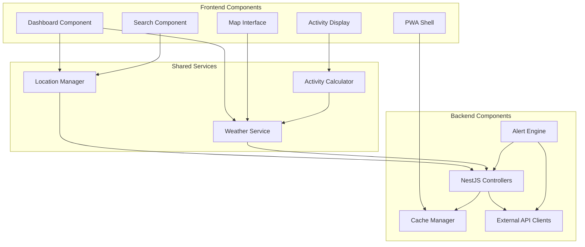

# Components

## Weather Service Component

**Responsibility:** Core weather data fetching, caching, and transformation logic

**Key Interfaces:**
- `fetchCurrentWeather(lat: number, lon: number): Observable<WeatherData>`
- `fetchForecast(locationId: string): Observable<WeatherForecast[]>`
- `getCachedWeather(key: string): WeatherData | null`

**Dependencies:** OpenWeatherMap API client, Cache Manager, Data Transformer utilities

**Technology Stack:** NestJS service with @Injectable decorator, Node-cache for in-memory storage, RxJS for reactive streams

## Location Manager Component

**Responsibility:** Manages user's saved locations, persistence, and ordering

**Key Interfaces:**
- `addLocation(location: CreateLocationDto): WeatherLocation`
- `reorderLocations(updates: OrderUpdate[]): void`
- `getLocations(): WeatherLocation[]`
- `enforceLocationLimit(): boolean`

**Dependencies:** Storage Service (IndexedDB on frontend, file system on backend), Weather Service for initial data

**Technology Stack:** Angular service with signals for state, NestJS controller for API endpoints, shared TypeScript interfaces

## Alert Engine Component

**Responsibility:** Monitors weather conditions and triggers precipitation/severe weather notifications

**Key Interfaces:**
- `checkPrecipitationAlerts(location: WeatherLocation): Alert | null`
- `subscribeToAlerts(subscription: PushSubscription): void`
- `processNWSAlerts(locationId: string): WeatherAlert[]`
- `respectQuietHours(location: LocationSettings): boolean`

**Dependencies:** Weather Service, NWS API client, Push Notification Service, Location Manager

**Technology Stack:** NestJS scheduled tasks (@Cron decorators), Web Push library for notifications, polling fallback for non-HTTPS

## Map Interface Component

**Responsibility:** Interactive Google Maps integration with weather overlay capabilities

**Key Interfaces:**
- `initializeMap(element: HTMLElement): void`
- `addWeatherLayer(type: LayerType): void`
- `handleMapClick(event: MapClickEvent): WeatherData`
- `toggleLayerOpacity(value: number): void`

**Dependencies:** Google Maps JavaScript API, Weather Service, Location Manager

**Technology Stack:** Angular component with ViewChild for map container, Google Maps JS SDK, RxJS for click streams

## Dashboard Component

**Responsibility:** Displays location cards with current weather and forecast flip animations

**Key Interfaces:**
- `renderLocationCards(): void`
- `handleCardFlip(locationId: string): void`
- `updateWeatherData(): void`
- `enableDragAndDrop(): void`

**Dependencies:** Location Manager, Weather Service, Activity Calculator, UI Component Library

**Technology Stack:** Angular standalone components, Angular Material cards, Angular animations API, CDK drag-drop

## Component Diagrams

