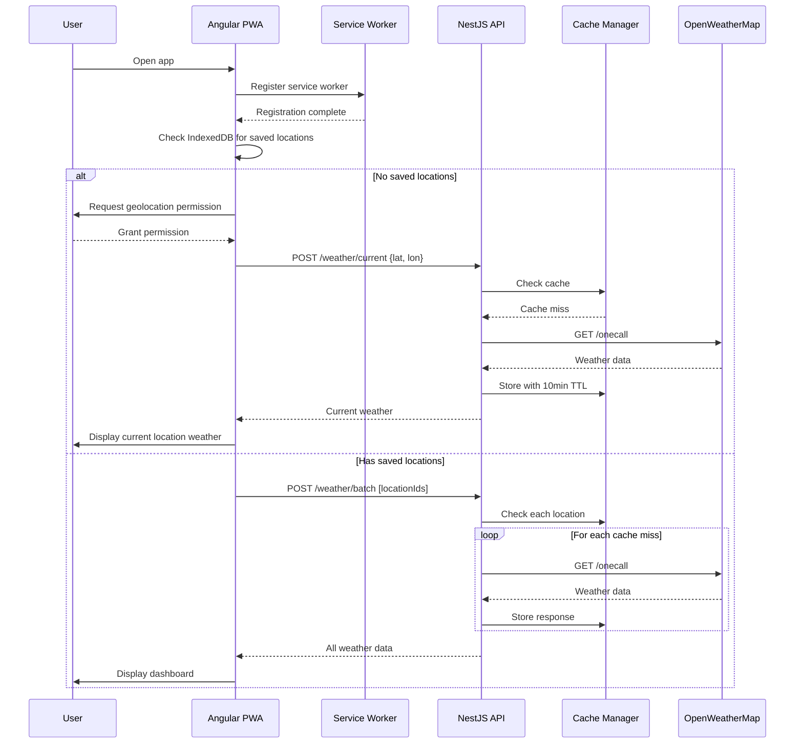
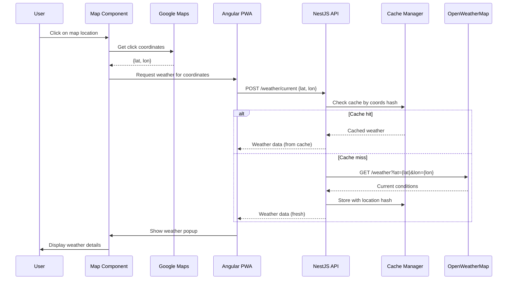
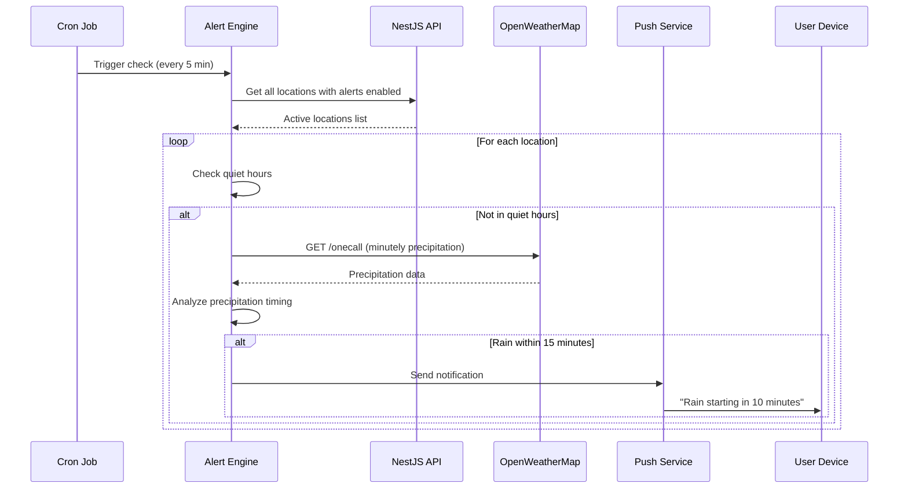

# Core Workflows

## Initial App Load and Location Setup

```mermaid
sequenceDiagram
    participant User
    participant PWA as Angular PWA
    participant SW as Service Worker
    participant API as NestJS API
    participant Cache as Cache Manager
    participant OWM as OpenWeatherMap

    User->>PWA: Open app
    PWA->>SW: Register service worker
    SW-->>PWA: Registration complete
    PWA->>PWA: Check IndexedDB for saved locations
    
    alt No saved locations
        PWA->>User: Request geolocation permission
        User-->>PWA: Grant permission
        PWA->>API: POST /weather/current {lat, lon}
        API->>Cache: Check cache
        Cache-->>API: Cache miss
        API->>OWM: GET /onecall
        OWM-->>API: Weather data
        API->>Cache: Store with 10min TTL
        API-->>PWA: Current weather
        PWA->>User: Display current location weather
    else Has saved locations
        PWA->>API: POST /weather/batch [locationIds]
        API->>Cache: Check each location
        loop For each cache miss
            API->>OWM: GET /onecall
            OWM-->>API: Weather data
            API->>Cache: Store response
        end
        API-->>PWA: All weather data
        PWA->>User: Display dashboard
    end
```

## Map Click Weather Fetch

```mermaid
sequenceDiagram
    participant User
    participant Map as Map Component
    participant GMaps as Google Maps
    participant PWA as Angular PWA
    participant API as NestJS API
    participant Cache as Cache Manager
    participant OWM as OpenWeatherMap

    User->>Map: Click on map location
    Map->>GMaps: Get click coordinates
    GMaps-->>Map: {lat, lon}
    Map->>PWA: Request weather for coordinates
    PWA->>API: POST /weather/current {lat, lon}
    
    API->>Cache: Check cache by coords hash
    alt Cache hit
        Cache-->>API: Cached weather
        API-->>PWA: Weather data (from cache)
    else Cache miss
        API->>OWM: GET /weather?lat={lat}&lon={lon}
        OWM-->>API: Current conditions
        API->>Cache: Store with location hash
        API-->>PWA: Weather data (fresh)
    end
    
    PWA->>Map: Show weather popup
    Map->>User: Display weather details
```

## Precipitation Alert Flow

```mermaid
sequenceDiagram
    participant Cron as Cron Job
    participant Alert as Alert Engine
    participant API as NestJS API
    participant OWM as OpenWeatherMap
    participant Push as Push Service
    participant User as User Device

    Cron->>Alert: Trigger check (every 5 min)
    Alert->>API: Get all locations with alerts enabled
    API-->>Alert: Active locations list
    
    loop For each location
        Alert->>Alert: Check quiet hours
        alt Not in quiet hours
            Alert->>OWM: GET /onecall (minutely precipitation)
            OWM-->>Alert: Precipitation data
            
            Alert->>Alert: Analyze precipitation timing
            
            alt Rain within 15 minutes
                Alert->>Push: Send notification
                Push->>User: "Rain starting in 10 minutes"
            end
        end
    end
```
