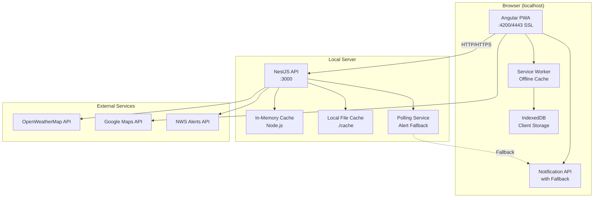

# High Level Architecture

## Technical Summary

DatDude Weather is a Progressive Web Application built on a modern fullstack TypeScript architecture, deployed as a monorepo with separate frontend and backend services running locally. The Angular 20 frontend delivers a responsive, offline-capable PWA with Material Design 3 UI served from localhost with SSL support for PWA features, while the NestJS backend runs as a local API server providing gateway, caching, and notification services. The system leverages OpenWeatherMap and Google Maps APIs through the backend proxy to protect API keys and optimize costs through in-memory caching. For the MVP, both services run on the local machine with the Angular dev server on port 4200 (with optional SSL) and NestJS on port 3000, achieving the PRD's goals of sub-3-second load times and 70% API call reduction through local caching strategies.

## Platform and Infrastructure Choice

**Platform:** Local Development Environment  
**Key Services:** Node.js runtime, In-memory caching, Local file storage, Browser IndexedDB  
**Deployment Host and Regions:** Localhost (127.0.0.1) for MVP phase  
**HTTPS Strategy:** Angular CLI --ssl flag for PWA features, localhost exemptions for testing

## Repository Structure

**Structure:** npm Workspaces Monorepo  
**Monorepo Tool:** npm workspaces (built-in)  
**Package Organization:** Apps (frontend, backend) + Shared types/utilities

## High Level Architecture Diagram



## Architectural Patterns

- **Local-First Development:** Everything runs on localhost for MVP - _Rationale:_ Zero infrastructure costs, immediate feedback loop, simple debugging
- **Progressive Enhancement for PWA:** Core features work on HTTP, enhanced features on HTTPS - _Rationale:_ Ensures functionality regardless of local setup
- **Backend for Frontend (BFF):** NestJS serves as dedicated API for the PWA - _Rationale:_ API key protection even in local environment, simulates production architecture
- **Repository Pattern:** Abstract data access in NestJS services - _Rationale:_ Easy transition to cloud deployment later
- **Observer Pattern:** RxJS throughout for reactive updates - _Rationale:_ Natural fit for real-time weather data streams and Angular's architecture
- **Offline-First PWA:** Service Worker with cache-first strategies - _Rationale:_ Weather data remains accessible without connection
- **In-Memory Caching:** Node.js memory for API response caching - _Rationale:_ Fast, simple for local development, no external dependencies
- **Graceful Degradation:** Polling fallback when push notifications unavailable - _Rationale:_ Ensures alerts work even without HTTPS
- **Shared Types Pattern:** TypeScript interfaces in shared library - _Rationale:_ Type safety across frontend/backend boundary

## Local Development Workarounds

**HTTPS Configuration:**
```bash
# Development with SSL (for PWA installation and push notifications)
ng serve --ssl --ssl-cert ~/.localhost-ssl/localhost.crt --ssl-key ~/.localhost-ssl/localhost.key

# Alternative: Use mkcert for trusted local certificates
mkcert -install
mkcert localhost
```

**API Configuration for Localhost:**
```typescript
// Google Maps API Console: Add these to allowed referrers
http://localhost:4200
https://localhost:4443
http://127.0.0.1:4200

// OpenWeatherMap: No referrer restrictions needed for server-side calls
```

**Push Notification Fallback:**
```typescript
// In weather.service.ts
if (location.protocol === 'https:' || location.hostname === 'localhost') {
  // Use native push notifications
  this.initializePushNotifications();
} else {
  // Fallback to polling
  this.initializePollingAlerts();
}
```
