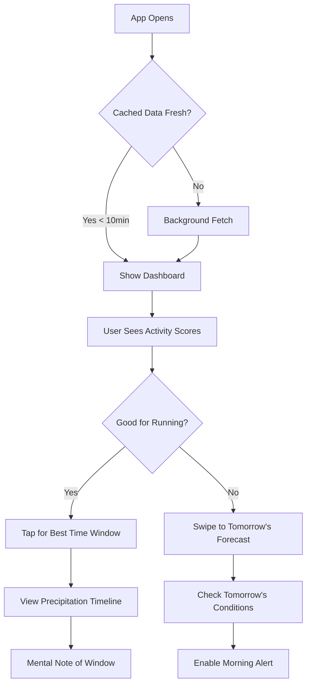
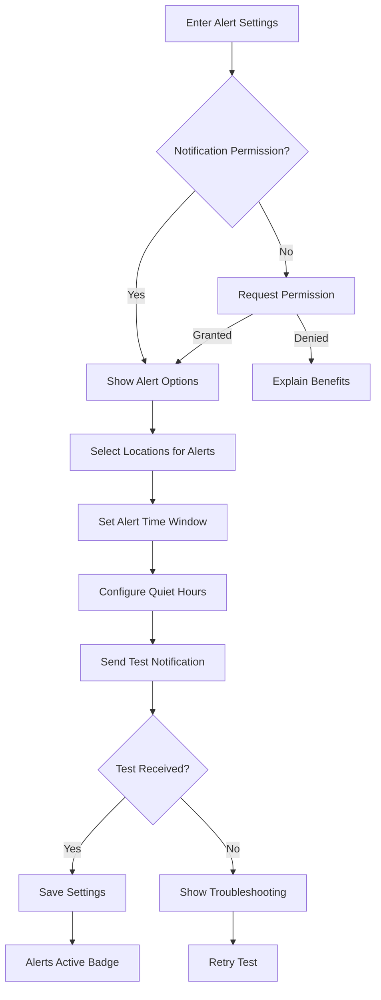
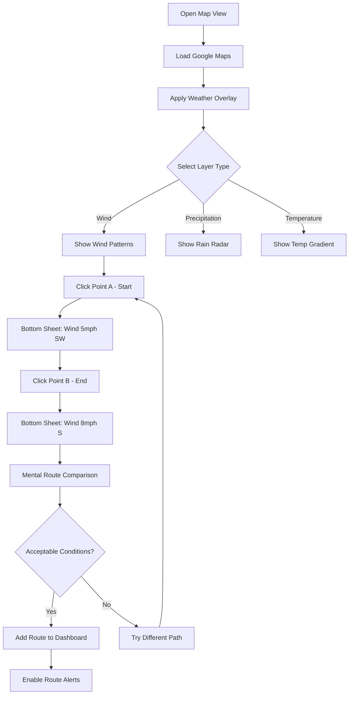

# DatDude Weather UI/UX Specification

## Introduction

This document defines the user experience goals, information architecture, user flows, and visual design specifications for DatDude Weather's user interface. It serves as the foundation for visual design and frontend development, ensuring a cohesive and user-centered experience.

### Overall UX Goals & Principles

#### Target User Personas

- **Tech-Savvy Outdoor Athlete:** Software engineers and IT professionals who run, cycle, or hike daily - need precision timing for optimal conditions, care about metrics like "feels like" temperature, humidity impact on performance, and wind resistance for cycling
- **Technical Garden Enthusiast:** Developers and data analysts with home gardens who track soil moisture windows, frost warnings, UV index for plant stress, and precipitation amounts for irrigation planning
- **Remote Worker Adventurer:** Technical professionals optimizing WFH schedules around outdoor windows - checking weather during standup calls, planning lunch rides, and timing evening runs between meetings

#### Usability Goals

- New users can add location and see activity recommendations within 30 seconds
- Power users can check all locations + activity scores in under 10 seconds
- Precipitation alerts achieve 90% accuracy for 10-minute warnings
- One-handed operation for all core features (checking during activities)
- Offline mode loads cached data instantly (< 500ms)
- Voice commands work with wind noise/breathing (outdoor scenario)

#### Design Principles

1. **Glanceable Insights** - Critical info readable in 2 seconds while moving
2. **Predictive Intelligence** - Proactively surface "windows of opportunity" for activities
3. **Data Density with Hierarchy** - Technical details available but never obstruct primary insights
4. **Context-Aware Displays** - Morning shows sunrise/conditions, evening shows next-day forecast
5. **Performance as Feature** - Sub-2-second loads even on trail with poor cell signal
6. **Customizable Depths** - Let users choose their data complexity level per activity

### Change Log

| Date | Version | Description | Author |
|------|---------|-------------|--------|
| 2024-08-26 | 1.0 | Initial UI/UX specification creation | Sally (UX Expert) |

## Information Architecture (IA)

### Site Map / Screen Inventory

```mermaid
graph TD
    A[App Launch] --> B[Map View - Primary]
    A --> C[Dashboard]
    A --> D[Activities Hub]
    
    B --> B1[Weather Overlays]
    B --> B2[Click Point Details]
    B --> B3[Location Search]
    B --> B4[Layer Controls]
    
    C --> C1[Location Cards]
    C --> C2[Quick Activity Scores]
    C --> C3[Precipitation Timeline]
    C --> C4[Alert Summary]
    
    D --> D1[Running Optimizer]
    D --> D2[Cycling Planner]
    D --> D3[Garden Calendar]
    D --> D4[Outdoor Work Windows]
    D --> D5[Stargazing Forecast]
    
    A --> E[Settings]
    E --> E1[Locations Manager]
    E --> E2[Alert Preferences]
    E --> E3[Activity Settings]
    E --> E4[Units & Display]
    E --> E5[Solar Calculator]
    
    A --> F[Data Deep Dive]
    F --> F1[Hourly Details]
    F --> F2[7-Day Trends]
    F --> F3[Historical Patterns]
```



### Navigation Structure

**Primary Navigation:** Bottom navigation bar (mobile) / Side rail (tablet+) with 4 main sections:
- Map (default view) - Interactive weather exploration with `@slideIn` animation for overlays
- Dashboard - Multi-location cards with `@flipCard` animation for forecast reveals
- Activities - Personalized recommendations with `@stagger` animation for list items
- Settings - Configuration with `@expand` animations for sections

**Secondary Navigation:** Contextual FABs with `@fabScale` animation and action sheets using `@slideUp` animation. All navigational transitions use Angular's `RouterOutlet` animations with `@routeSlide` for smooth view changes.

**Animation Principles (using Angular Animations API):**
- **State Changes:** Use `trigger()` and `state()` for weather condition transitions
- **Route Transitions:** Implement `query()` and `group()` for coordinated page animations
- **List Animations:** Apply `stagger()` for location cards and activity recommendations
- **Micro-interactions:** Leverage `keyframes()` for weather icon animations and loading states
- **Performance:** Use `animateChild()` strategically and CSS transform properties for 60fps

**Breadcrumb Strategy:** Minimal breadcrumbs with `@fadeIn` animation - only for deep-dive data views. Primary navigation always visible with `@slideReveal` for context switching.

## User Flows

### Flow 1: Quick Activity Check

**User Goal:** Check if conditions are good for a morning run before getting dressed

**Entry Points:** 
- App launch (primary)
- Push notification tap
- Widget tap (PWA)

**Success Criteria:** User can determine run viability within 10 seconds

#### Flow Diagram


#### Edge Cases & Error Handling:
- No network: Show cached data with "last updated" timestamp
- Location services off: Prompt to enable or use saved location
- All activities show "Poor": Suggest indoor alternatives
- Rapid condition changes: Show "Conditions Changing" banner

**Notes:** Animation speed critical here - all transitions under 300ms using Angular's animation API

### Flow 2: Precipitation Alert Setup

**User Goal:** Get notified 10 minutes before rain during outdoor activities

**Entry Points:**
- Settings > Alerts
- Location card options menu
- Onboarding flow

**Success Criteria:** Alert configured and test notification received

#### Flow Diagram


#### Edge Cases & Error Handling:
- iOS Safari limitations: Show manual enablement guide
- Multiple locations selected: Clarify alert grouping behavior
- Quiet hours overlap: Visual indicator of active/quiet periods
- Background app restrictions: Explain battery optimization impacts

**Notes:** Use Angular service worker for reliable push notification handling

### Flow 3: Map Weather Exploration

**User Goal:** Find optimal cycling route based on wind patterns and precipitation

**Entry Points:**
- Map tab (primary)
- "Explore Conditions" from activity card

**Success Criteria:** User identifies route with favorable conditions

#### Flow Diagram


#### Edge Cases & Error Handling:
- Map tiles slow to load: Show skeleton overlay
- Clicking ocean/invalid area: Show nearest valid point
- Overlay data gaps: Display "No data" gracefully
- Route too long: Suggest breaking into segments

**Notes:** Implement smooth pan/zoom with Angular animations, debounce click events for performance

## Wireframes & Mockups

**Primary Design Files:** Figma (recommended) - [Project files to be created]

### Key Screen Layouts

#### Map View (Primary Interface)

**Purpose:** Interactive weather exploration with real-time overlay data for route planning and condition discovery

**Key Elements:**
- Full-screen Google Maps canvas with 85% viewport height
- Floating weather layer toggle (FAB) - bottom right with `@fabScale` animation
- Mini dashboard strip (collapsed) - bottom edge showing current location conditions
- Search bar (Material 3 filled) - top with voice input icon
- Layer opacity slider - left edge, auto-hides after 3 seconds

**Interaction Notes:** 
- Pinch/zoom maintains overlay clarity using Angular CDK virtual scrolling
- Long-press triggers haptic feedback and point selection
- Double-tap zooms to point with `@smoothZoom` animation
- Swipe up reveals dashboard, swipe down returns to map

**Design File Reference:** /screens/map-view-interactions

#### Dashboard View (Multi-Location)

**Purpose:** At-a-glance weather for up to 5 saved locations with activity scoring

**Key Elements:**
- Responsive grid: 1 column (mobile), 2 columns (tablet), 3 columns (desktop)
- Location cards with flip animation capability
- Activity score chips (color-coded: green/yellow/red)
- Precipitation timeline scrubber (next 2 hours)
- Pull-to-refresh with Material 3 progress indicator

**Interaction Notes:**
- Cards use `@flip3D` animation with preserve-3d transform
- Drag handle appears on long-press for reordering
- Swipe left reveals delete option with undo snackbar
- Activity chips expand on tap to show reasoning

**Design File Reference:** /screens/dashboard-cards-states

#### Activity Hub

**Purpose:** Consolidated view of all outdoor activity recommendations with timing optimization

**Key Elements:**
- Segmented control for activity type (Running, Cycling, Garden, etc.)
- Timeline view (24-hour) with color-gradient quality indicators
- "Best window" callout cards with start/end times
- Weather factor breakdown (temp, wind, humidity, precipitation)
- Quick-add to calendar integration button

**Interaction Notes:**
- Horizontal scroll on timeline with momentum scrolling
- Tap hour block for detailed conditions
- Use Angular CDK drag-drop for custom activity ordering
- Material 3 time picker for setting activity preferences

**Design File Reference:** /screens/activity-hub-timeline

## Component Library / Design System

**Design System Approach:** Material Design 3 (Material You) with custom weather-themed extensions. Use Angular Material as base component library with custom theme tokens for weather-specific visualizations. Implement dynamic color that responds to current weather conditions.

### Core Components

#### WeatherCard Component

**Purpose:** Primary container for location-based weather display with flip animation capability

**Variants:** 
- Default (dashboard view)
- Compact (map overlay)
- Expanded (detail view)
- Loading (skeleton state)

**States:** 
- Default, Hover, Active, Dragging, Flipped, Offline, Alert, Updating

**Usage Guidelines:** 
- Always show location name and current temperature
- Flip animation must complete in 600ms using Angular animations
- Include activity chips only in default variant
- Use elevation changes for interactive states (md-elevation 1→3)

#### ActivityChip Component

**Purpose:** Compact indicator showing activity viability with expandable details

**Variants:**
- Good (green), Fair (yellow), Poor (red)
- Compact (icon only), Standard (icon + label), Expanded (with reason)

**States:**
- Default, Hover, Pressed, Disabled, Loading

**Usage Guidelines:**
- Use Angular Material's chip component as base
- Animate color transitions when conditions change
- Include tooltips on hover with primary factor
- Group related activities in ChipList containers

#### PrecipitationTimeline Component

**Purpose:** Visualize precipitation probability and intensity over next 2-24 hours

**Variants:**
- Compact (2 hours), Standard (12 hours), Extended (24 hours)
- Linear (horizontal scroll), Circular (radar-style)

**States:**
- Default, Scrubbing, Alerting, Historical, Updating

**Usage Guidelines:**
- Use Canvas API for smooth gradients
- Implement touch-friendly scrubber (48dp target)
- Animate new data points entering timeline
- Show "now" indicator with pulsing animation

#### MapOverlayControl Component

**Purpose:** Layer selection and opacity control for weather overlays

**Variants:**
- Floating (FAB-based), Drawer (side panel), Mini (icon only)

**States:**
- Collapsed, Expanded, Selecting, Adjusting

**Usage Guidelines:**
- Use Angular CDK Overlay for positioning
- Implement backdrop click to dismiss
- Save user preferences in IndexedDB
- Smooth transitions between states (300ms)

#### VoiceSearchButton Component

**Purpose:** Activate voice input for location search with visual feedback

**Variants:**
- Standard (with label), Icon-only, Embedded (in search bar)

**States:**
- Idle, Listening, Processing, Success, Error

**Usage Guidelines:**
- Use Web Speech API with fallback
- Show waveform animation during listening
- Provide haptic feedback on activation
- Clear visual state transitions

## Branding & Style Guide

### Visual Identity

**Brand Guidelines:** Material Design 3 Dynamic Color system with weather-responsive theming

### Color Palette

| Color Type | Hex Code | Usage |
|------------|----------|-------|
| Primary | #1976D2 (Clear Sky Blue) | Primary actions, active states, clear weather |
| Secondary | #FFA726 (Sunset Orange) | Activity highlights, sunset/sunrise indicators |
| Accent | #4CAF50 (Activity Green) | Good conditions, success states |
| Success | #2E7D32 | Confirmations, optimal conditions |
| Warning | #F57C00 | Weather watches, caution states |
| Error | #C62828 | Severe weather, alerts, errors |
| Neutral | #212121, #757575, #E0E0E0 | Text hierarchy, borders, backgrounds |

**Dynamic Weather Theming:**
- Clear: Blue primary (#1976D2)
- Cloudy: Grey primary (#616161)
- Rainy: Deep blue (#0D47A1)
- Stormy: Purple (#4A148C)
- Snowy: Light blue (#81D4FA)

### Typography

#### Font Families
- **Primary:** Roboto (UI text, navigation)
- **Secondary:** Google Sans (headers, branding)
- **Monospace:** Roboto Mono (data displays, coordinates)

#### Type Scale

| Element | Size | Weight | Line Height |
|---------|------|--------|-------------|
| H1 | 32sp | 400 | 40sp |
| H2 | 24sp | 500 | 32sp |
| H3 | 20sp | 500 | 28sp |
| Body | 16sp | 400 | 24sp |
| Small | 14sp | 400 | 20sp |

### Iconography

**Icon Library:** Material Symbols with weather extensions

**Usage Guidelines:** 
- Use filled icons for active/selected states
- Outlined icons for inactive states
- Rounded variant for friendly feel
- Custom weather icons for conditions not in Material set
- Animate weather icons subtly (clouds drift, rain falls)

### Spacing & Layout

**Grid System:** 
- 8dp base grid following Material Design
- 16dp padding on mobile, 24dp on tablet/desktop
- Card margins: 8dp between cards
- Responsive columns: 1 (mobile) → 2 (tablet) → 3 (desktop)

**Spacing Scale:**
- xs: 4dp
- sm: 8dp  
- md: 16dp
- lg: 24dp
- xl: 32dp
- xxl: 48dp

## Accessibility Requirements

### Compliance Target

**Standard:** WCAG 2.1 Level AA compliance minimum, with select AAA criteria for critical features

### Key Requirements

**Visual:**
- Color contrast ratios: 4.5:1 for normal text, 3:1 for large text, 7:1 for critical weather alerts
- Focus indicators: 3px solid outline with 2px offset, high contrast color
- Text sizing: Minimum 16px base, support 200% zoom without horizontal scroll

**Interaction:**
- Keyboard navigation: Full app navigable via Tab, Arrow keys, and Enter/Space
- Screen reader support: ARIA labels for all interactive elements, live regions for updates
- Touch targets: Minimum 48x48dp for all interactive elements, 60dp for primary actions

**Content:**
- Alternative text: Descriptive alt text for weather icons and map overlays
- Heading structure: Logical h1-h6 hierarchy, skip navigation links
- Form labels: Clear, persistent labels for all inputs, error messages in text (not just color)

### Testing Strategy

- Automated testing with Angular CDK a11y testing utilities
- Manual testing with NVDA (Windows), JAWS, and VoiceOver (iOS/macOS)
- Color contrast validation with Chrome DevTools
- Keyboard-only navigation testing for all user flows
- Testing in outdoor brightness conditions
- Voice control testing for hands-free operation

**Additional Outdoor-Specific Considerations:**
- High contrast mode for bright sunlight visibility
- Large touch targets for use with gloves
- Voice feedback for critical alerts when visual attention unavailable
- Reduced motion mode for users sensitive to animations

## Responsiveness Strategy

### Breakpoints

| Breakpoint | Min Width | Max Width | Target Devices |
|------------|-----------|-----------|----------------|
| Mobile | 320px | 767px | Phones, smartwatches (PWA) |
| Tablet | 768px | 1023px | Tablets, foldables, landscape phones |
| Desktop | 1024px | 1439px | Laptops, desktop monitors |
| Wide | 1440px | - | Large monitors, TV displays |

### Adaptation Patterns

**Layout Changes:** 
- Mobile: Single column with 100% width cards, sticky headers, safe area padding
- Tablet: 2-column masonry grid, collapsible sidebar, floating action buttons
- Desktop: 3-column grid with fixed sidebars, inline expandable details
- Wide: 4+ columns, dual sidebars, picture-in-picture weather radar

**Navigation Changes:**
- Mobile: Bottom tabs (thumb-reachable), gesture navigation, pull-down command palette
- Tablet: Rail navigation with adaptive labels, swipe between sections
- Desktop: Persistent sidebar, breadcrumbs, keyboard navigation hints
- Wide: Multi-level navigation, customizable workspace layouts

**Content Priority:**
- Mobile: Current + next hour focus, swipe for more, collapsed details
- Tablet: 6-hour timeline visible, activity cards expanded
- Desktop: Full day view, all data points visible, comparison mode
- Wide: Multi-day overview, split-screen locations, data export tools

**Interaction Changes:**
- Mobile: Large touch targets (60dp), swipe gestures, haptic feedback, shake-to-refresh
- Tablet: Hover previews on stylus, multi-touch gestures, split-view support
- Desktop: Hover states, right-click menus, keyboard shortcuts (Ctrl+L for locations)
- Wide: Draggable panels, workspace saving, multi-monitor support

**PWA & Mobile Optimizations:**
- Standalone mode: Hide browser UI, use full screen
- Install prompt: Smart timing after 3rd visit
- Viewport meta: `viewport-fit=cover` for edge-to-edge design
- Touch detection: Dynamically adjust UI density based on input type
- Orientation handling: Optimize for both portrait (walking) and landscape (cycling mount)

**Angular Implementation:**
- Use Angular CDK Layout module with `breakpointObserver.observe()`
- Implement responsive images: `` with WebP fallbacks
- Lazy load route modules based on device capabilities
- Use CSS Container Queries for component-level responsiveness
- Implement `@angular/cdk/a11y` LiveAnnouncer for screen size changes

**Performance by Viewport:**
- Mobile: Fetch only essential data, 24-hour max
- Tablet: Load 3-day forecast, defer extended data
- Desktop: Full 7-day data, prefetch adjacent locations
- Wide: Load all data, enable background sync

## Animation & Micro-interactions

### Motion Principles

1. **Purpose-Driven Motion** - Every animation serves a functional purpose, not decoration
2. **Performance First** - All animations run at 60fps using GPU-accelerated properties
3. **Natural Easing** - Use Material Design easing curves (ease-in-out for entries, ease-out for exits)
4. **Respect Preferences** - Honor `prefers-reduced-motion` for accessibility
5. **Contextual Speed** - Quick actions (100-200ms), transitions (300ms), complex (400-600ms)

### Key Animations

- **Route Transitions:** Shared element transitions between views using Angular Router animations (Duration: 300ms, Easing: cubic-bezier(0.4, 0.0, 0.2, 1))
- **Weather Card Flip:** 3D card rotation revealing extended forecast on back (Duration: 600ms, Easing: ease-in-out)
- **Activity Score Pulse:** Subtle scale animation when conditions change (Duration: 400ms, Easing: ease-out)
- **Map Overlay Fade:** Smooth opacity transition when switching weather layers (Duration: 250ms, Easing: linear)
- **Loading Skeleton:** Shimmer effect on content placeholders using gradient animation (Duration: 1500ms, Easing: ease-in-out)
- **Pull-to-Refresh:** Elastic overscroll with rotation animation on spinner (Duration: Variable, Easing: spring physics)
- **Precipitation Alert:** Attention-grabbing slide-in with slight bounce (Duration: 500ms, Easing: cubic-bezier(0.68, -0.55, 0.265, 1.55))
- **Temperature Change:** Number ticker animation when temperature updates (Duration: 800ms, Easing: ease-out)
- **Wind Direction:** Smooth rotation of wind indicator arrow (Duration: 1000ms, Easing: ease-in-out)
- **Chart Updates:** Staggered bar/line animations for data visualization (Duration: 50ms per item, Easing: ease-out)

**Angular Animation Implementation:**
```typescript
// Example: Weather card flip animation
trigger('cardFlip', [
  state('front', style({ transform: 'rotateY(0)' })),
  state('back', style({ transform: 'rotateY(180deg)' })),
  transition('front <=> back', animate('600ms ease-in-out'))
])
```

**Micro-interactions:**
- Touch ripples on all clickable elements (Material Design ripple)
- Hover elevation changes on cards (1dp → 3dp)
- Focus ring animations (fade-in 150ms)
- Icon morphing for weather condition changes
- Haptic feedback for critical actions (using Vibration API)

## Performance Considerations

### Performance Goals
- **Page Load:** Initial meaningful paint < 1.5s, fully interactive < 3s on 3G
- **Interaction Response:** All user interactions respond within 100ms
- **Animation FPS:** Maintain 60fps for all animations, even on mid-range devices

### Design Strategies
- **Progressive Loading:** Show skeleton screens immediately, load data incrementally
- **Image Optimization:** Use WebP with JPEG fallbacks, implement lazy loading for off-screen images
- **Bundle Splitting:** Separate vendor, main, and feature modules for optimal caching
- **Service Worker:** Cache critical assets and API responses for offline functionality
- **Virtual Scrolling:** Use Angular CDK virtual scrolling for long lists
- **Debouncing:** Throttle map interactions and search inputs to prevent excessive API calls
- **Preconnect:** Add DNS prefetch for weather API and map tile servers
- **Critical CSS:** Inline above-the-fold styles, defer non-critical stylesheets
- **Web Fonts:** Use font-display: swap, subset fonts to required characters
- **Memory Management:** Implement OnPush change detection, unsubscribe from observables

## Next Steps

### Immediate Actions
1. Review this specification with stakeholders for approval
2. Create Figma project and begin high-fidelity mockups based on wireframe specifications
3. Set up Angular Material theme with custom weather-responsive tokens
4. Implement core component library starting with WeatherCard and ActivityChip
5. Configure PWA manifest and service worker for offline functionality
6. Set up responsive breakpoint utilities using Angular CDK
7. Create animation module with reusable triggers

### Design Handoff Checklist
- ✅ All user flows documented
- ✅ Component inventory complete
- ✅ Accessibility requirements defined
- ✅ Responsive strategy clear
- ✅ Brand guidelines incorporated
- ✅ Performance goals established

### Open Questions for Discussion
- Should we implement a companion smartwatch app for quick glances during activities?
- Do we need custom weather iconography or will Material Symbols suffice?
- Should activity recommendations be ML-powered based on user behavior?
- Is real-time collaboration (sharing locations with friends) in scope?

### Recommended Review Process
1. **Design Review:** UX team validates against user research findings
2. **Technical Review:** Development team assesses implementation feasibility
3. **Accessibility Audit:** Ensure WCAG compliance strategy is achievable
4. **Performance Review:** Validate that goals align with technical constraints
5. **Stakeholder Sign-off:** Present to product owner for final approval

### Handoff to Development
Once approved, this specification should be used alongside:
- Architecture documentation for technical implementation
- API specifications for weather data integration
- Testing strategy for quality assurance
- Deployment plan for PWA distribution

## Checklist Results
_To be completed after running UI/UX checklist against this document_